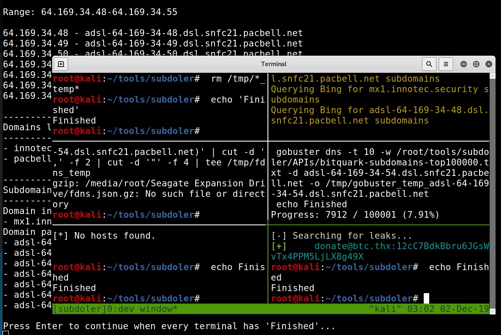
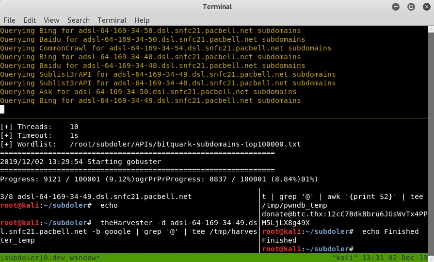
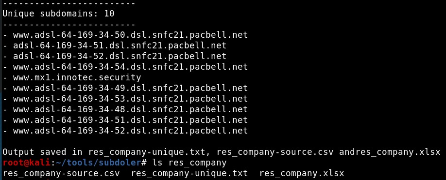
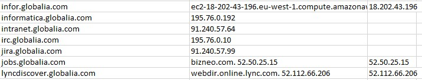

# Subdoler

Subdomain lister using some already created tools 


## Usage 1: Extract subdomains from a list of domains

```
python subdoler.py -i INPUT_FILE -o OUTPUT_FILE -t TYPE
```
- INPUT_FILE: Text file with a list of domains

- OUTPUT_FILE: CSV file with the list of subdomains, their DNS resolution and reverse resolution.

- TYPE: "tmux" opens a terminal with tmux sessions and "gnome" (default value) opens many terminals


## Options

To use these tools for subdomain enumeration set their value *True* in the *config.py* file:

- Amass - Only the passive scan mode

- IPv4info - Using the API. Token needed

- Findsubdomain - Using the API. Token needed

- DNSDumpster - Using the API

- Gobuster - Bruteforce mode. You can change the dictionary used

- FDNS - You must [download from here](https://opendata.rapid7.com/sonar.fdns_v2/) and reference the file in the config.py file


There are extra options for enumerating leaked information:

- TheHarvester: Search leaked email addresses

- PwnDB: Search leaked credentials (tor service gets started)


## Screenshots

First, the input file with the list of domains and the output csv files are set:



Using the "-t tmux" option, a terminal with tmux sessions opens:



When every tmux session has finished, press Enter and the list of subdomains appears:



The final result is a CSV file which shows the list of subdomains, the DNS resolution and the reverse DNS resolution:




## Usage 2: Extract domains from a list of IP ranges

```
python range_domains.py -i INPUT_FILE -o OUTPUT_FILE
```
