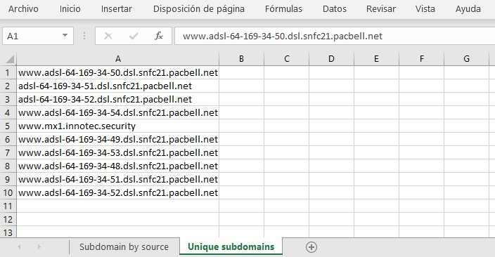

# Subdoler

Subdomain lister from a list of companies names, IP ranges or domains. 


## Installation

```
git clone https://github.com/ricardojoserf/subdoler
cd subdoler/
cd install/
sh install.sh
```

## Subdomains enumeration settings

Set the value to *True* in the *config.py* file to use these tools:

- [Amass](https://github.com/OWASP/Amass) - Passive scan mode

- [IPv4info](http://ipv4info.com/tools/api/) - Using the API (Token needed)

- [Findsubdomains](https://findsubdomains.com/) - Using an API (Token needed)

- [DNSDumpster](https://github.com/PaulSec/API-dnsdumpster.com) - Using a Python API

- [Gobuster](https://github.com/OJ/gobuster) - Bruteforce mode with a custom dictionary (using one from this [repo](https://github.com/danielmiessler/SecLists) by default)

- [FDNS](https://opendata.rapid7.com/sonar.fdns_v2/) - You must [download the file from here](https://opendata.rapid7.com/sonar.fdns_v2/) and set its path in *config.py*


There are extra options to enumerate leaked information:

- [TheHarvester](https://github.com/laramies/theHarvester): Search leaked email addresses

- [PwnDB](https://github.com/davidtavarez/pwndb): Search leaked credentials (tor service gets started)

----------------------------------------------------------


## From Companies name

```
python subdoler.py -c COMPANIES_FILE -o OUTPUT_PREFIX -t {tmux|gnome-terminal}
```

It calculates the IP ranges of the companies in IPv4info and extracts the domains in these IPs: 


Then, it creates a Tmux session which calculates the subdomains of the calculated domains and subdomains:


When the subdomains calculation finishes (when the user clicks the 'Enter' button), the unique subdomains are listed and the output is stored in 3 files:


The CSV file contains the subdomains with the program which calculated them, the reverse lookup IP and which range it is part of. The TXT file contains a list of unique subdomains:


The XLSX file contains the same information in two different sheets:





## From IP ranges


```
python subdoler.py  -r RANGES_FILE -o OUTPUT_PREFIX -t {tmux|gnome-terminal}
```

It skips the step of calculatig the ranges of the companies, working similarly but with the IP ranges directly:


## From Domains list


```
python subdoler.py -d DOMAINS_FILE -o OUTPUT_PREFIX -t {tmux|gnome-terminal}
```

It skips the step of calculatig the ranges of the companies and the domains in IP ranges, working similarly but with the domains directly:


----------------------------------------------------------

## Domains from Companies name

```
python range_domains.py -c COMPANIES_FILE -o OUTPUT_FILE
```

Using *range_domains.py* instead of *subdoler.py*, you can skip the final step of calculating the subdomains, calculating just the IP ranges of the companies and the domains in them:


These are stored in the output file:


## Domains from IP ranges 

Also using *range_domains.py* you can just get domains in IP ranges, skipping the step of calculating the IP ranges from the companies name:

```
python range_domains.py -r RANGES_FILE -o OUTPUT_FILE
```


----------------------------------------------------------
