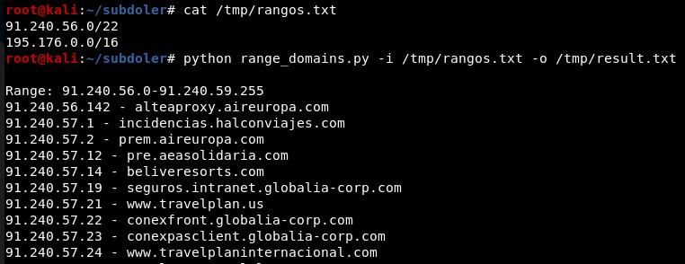
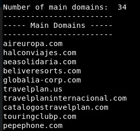
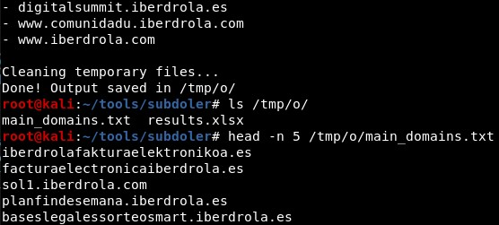

# Subdoler

Subdomain lister using some already created tools 


## Installation

```
git clone https://github.com/ricardojoserf/subdoler
cd subdoler/
cd install/
sh install.sh
```


## Usage 1: Extract domains from a list of IP ranges

```
python range_domains.py -i INPUT_FILE -o OUTPUT_FILE
```

- INPUT_FILE: Text file with a list of IP ranges

- OUTPUT_FILE: Text file with the list of domains


#### Screenshots

First, the IP addresses and the domains are displayed:



The list of "main" domains (the ones with format *domain_name.domain_extension*) is displayed:



The output file contains only the list of all the domains extracted from the IP addresses (not the "main" ones):




----------------------------------------------------------


## Usage 2: Extract subdomains from a list of domains

```
python subdoler.py -i INPUT_FILE -o OUTPUT_FILE -t TYPE
```

- INPUT_FILE: Text file with a list of domains

- OUTPUT_FILE: CSV file with the list of subdomains, their DNS resolution and reverse resolution.

- TYPE: "tmux" opens a terminal with tmux sessions and "gnome" (default value) opens many terminals


#### Options

To use these tools for subdomain enumeration set their value *True* in the *config.py* file:

- [Amass](https://github.com/OWASP/Amass) - Only the passive scan mode

- [IPv4info](http://ipv4info.com/tools/api/) - Using the API. Token needed

- [Findsubdomains](https://findsubdomains.com/) - Using an API. Token needed

- [DNSDumpster](https://github.com/PaulSec/API-dnsdumpster.com) - Using an unofficial API

- [Gobuster](https://github.com/OJ/gobuster) - Bruteforce mode with a cusom dictionary (using one from this [repo](https://github.com/danielmiessler/SecLists) by default)

- [FDNS](https://opendata.rapid7.com/sonar.fdns_v2/) - You must [download the file from here](https://opendata.rapid7.com/sonar.fdns_v2/) and reference the file in the config.py file


There are extra options for enumerating leaked information:

- [TheHarvester](https://github.com/laramies/theHarvester): Search leaked email addresses

- [PwnDB](https://github.com/davidtavarez/pwndb): Search leaked credentials (tor service gets started)


#### Screenshots

First, the input file with the list of domains and the output CSV files are set:


Using the "-t tmux" option, a terminal with tmux sessions gets opened:


When every tmux session has finished, press Enter and the list of subdomains appears:


The final result is a CSV file which shows the list of subdomains, the DNS resolution and the reverse DNS resolution:


## TODOS

- Extract ranges from name - done, to be implemented

- Concurency

- Add the source of finding the subdomain -> Uniq after that with all

- Check if detected IP in the ranges

- Analysis with Shodan
