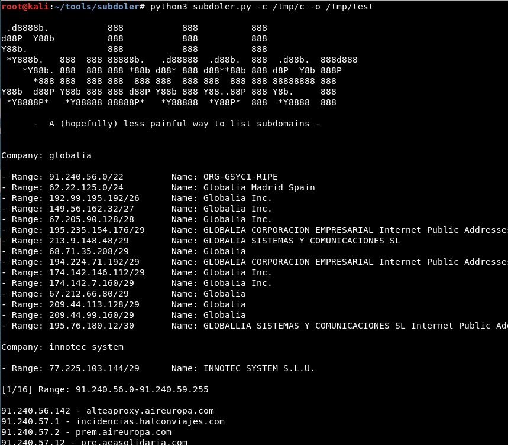
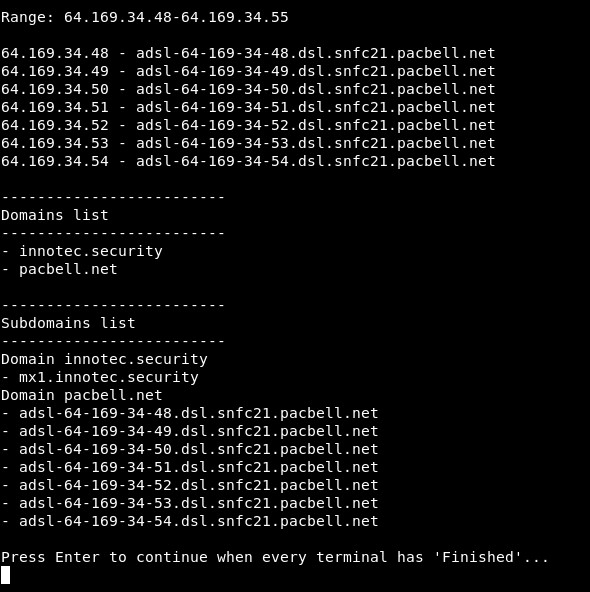
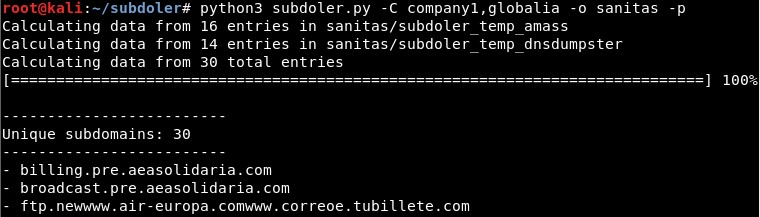
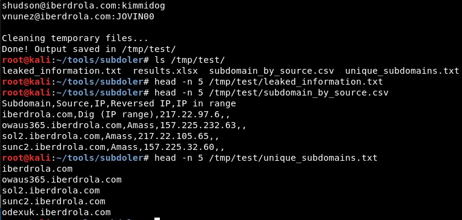
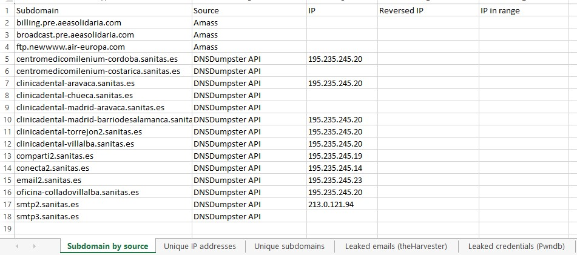
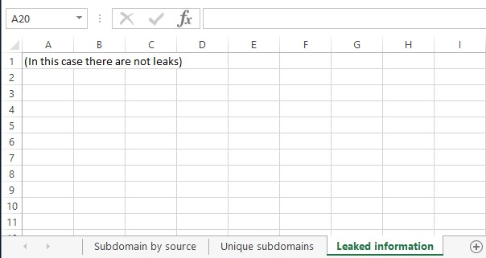
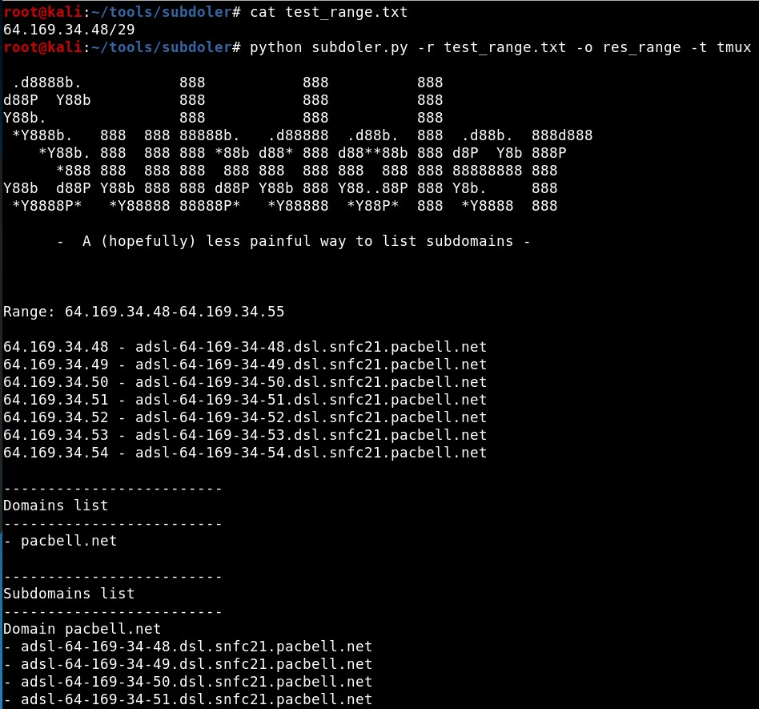
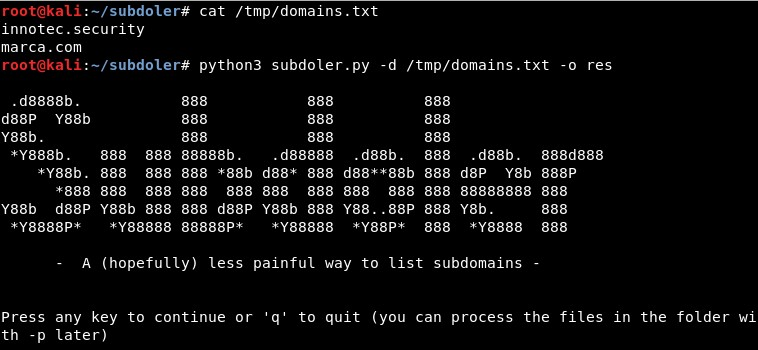

# Subdoler

Subdomain lister from a list of companies names, IP ranges or domains. 


## Installation

```
git clone https://github.com/ricardojoserf/subdoler
cd subdoler/install/ 
sh install.sh 
pip3 install -r requirements.txt
pip install -r requirements.txt
cd ..
```

## Subdomains enumeration settings


- [Amass](https://github.com/OWASP/Amass) - Passive scan mode

- [Gobuster](https://github.com/OJ/gobuster) - Bruteforce mode with a custom dictionary (using one from this [repo](https://github.com/danielmiessler/SecLists) by default)

- [Findsubdomains](https://findsubdomains.com/) - Using an API (Token needed)

- [DNSDumpster](https://github.com/PaulSec/API-dnsdumpster.com) - Using a Python API

- [FDNS](https://opendata.rapid7.com/sonar.fdns_v2/) - You must [download the file from here](https://opendata.rapid7.com/sonar.fdns_v2/) and set its path in *config.py*


There are extra options to enumerate leaked information:

- [TheHarvester](https://github.com/laramies/theHarvester): Search leaked email addresses

- [PwnDB](https://github.com/davidtavarez/pwndb): Search leaked credentials (the service *tor* gets started)

NOTE: Set the value to "True" in the config.py file to use these tools:


----------------------------------------------------------


## Subdomains from Companies list

It calculates the IP ranges of the companies in IPv4info, extracts the domains in these IPs and then the subdomains: 

```
python subdoler.py -c COMPANIES_FILE -o OUTPUT_PREFIX -t {tmux|gnome-terminal}
```

First the IP ranges of each company are calculated:



Second, the domains in these IP ranges:


Third, it calculates the subdomains of the domains in a Tmux session:


The program will wait until the user clicks the 'Enter' button:







When the subdomains calculation finishes, the unique subdomains are listed and the output is stored in files:


Four files are created in the specified output directory:

- The CSV file (*prefix-source.csv*) contains the subdomains with the program which discovered them, the reverse lookup IP and which range it is part of

- The second CSV file (*prefix-ranges.csv*) contains information about the ranges

- The subdomains TXT files (*prefix-unique.txt*) contains a list of unique subdomains.

- The leaks TXT file (*prefix-leaked.txt*) contains the leaked email accounts and credentials. 

- The XLSX file (*prefix.xlsx*) contains the same information in a single file.









## Subdomains from IP ranges


It skips the step of calculatig the ranges of the companies, working similarly but with the IP ranges directly:

```
python subdoler.py  -r RANGES_FILE -o OUTPUT_PREFIX -t {tmux|gnome-terminal}
```




## Subdomains from Domains list


It skips the step of calculatig the ranges of the companies and the domains in IP ranges, working similarly but with the domains directly:

```
python subdoler.py -d DOMAINS_FILE -o OUTPUT_PREFIX -t {tmux|gnome-terminal}
```




----------------------------------------------------------


## Domains from Companies list

Using *range_domains.py* instead of *subdoler.py*, you can skip the final step of calculating the subdomains, calculating just the IP ranges of the companies and the domains in them:

```
python range_domains.py -c COMPANIES_FILE -o OUTPUT_FILE
```


These are stored in the output file:


## Domains from IP ranges 

Also using *range_domains.py* you can just get domains in IP ranges, skipping the step of calculating the IP ranges from the companies name:

```
python range_domains.py -r RANGES_FILE -o OUTPUT_FILE
```


